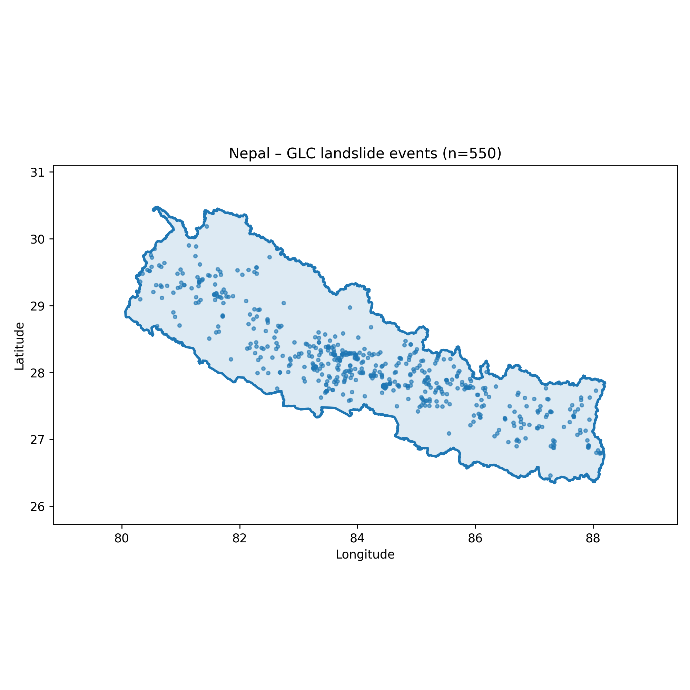
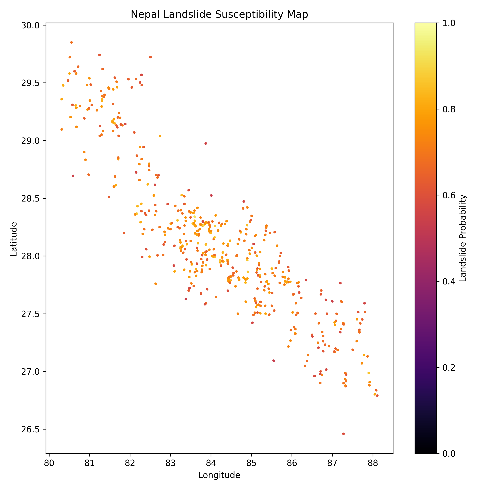
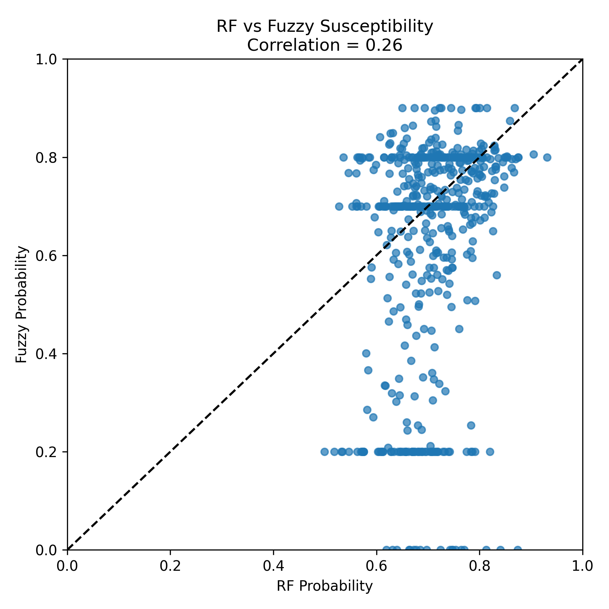
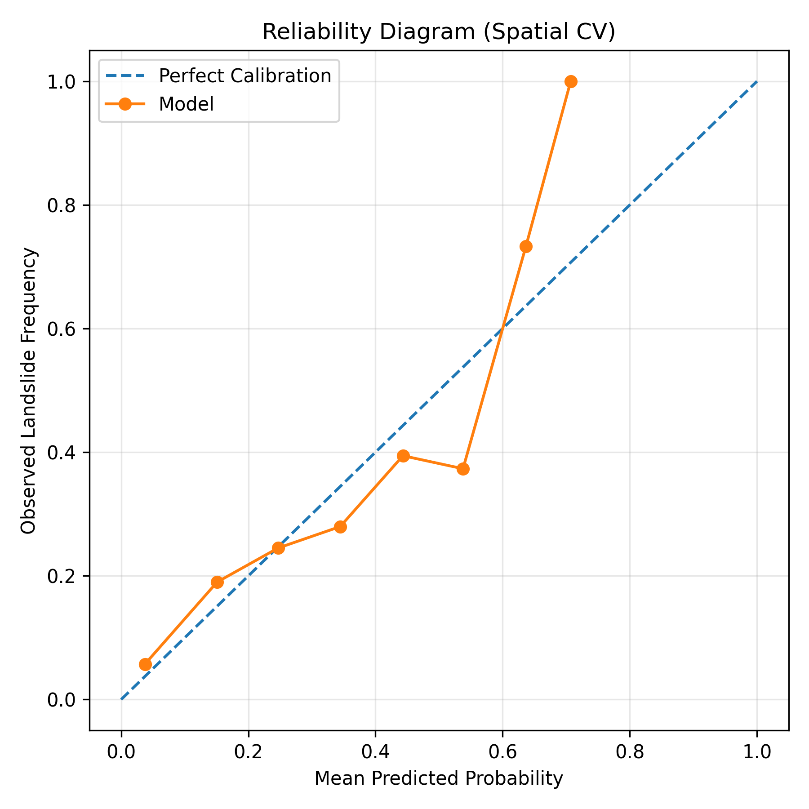

# Landslide Susceptibility Modeling Framework

> A reproducible, uncertainty-aware geospatial pipeline for landslide susceptibility modeling using machine learning and fuzzy logic.

---

## Overview

This project presents a **modular and reproducible framework** for landslide susceptibility modeling, combining geospatial data processing with both **machine learning** and **fuzzy logic approaches**.

Rather than focusing on a single modeling paradigm, this work is built around a **comparative perspective**, investigating how different approaches behave under the same data conditions.

This work emphasizes:

- **Dataset construction and reliability**
- **Spatial uncertainty handling**
- **Controlled negative sampling**
- **Reproducible geospatial workflows**
- **Comparison between machine learning and fuzzy logic models**

The project is designed as a **research-oriented modeling framework**, serving both as a standalone system and as a foundation for future academic work.

---

## Objectives

- Build a **clean and extensible geospatial modeling pipeline**
- Address challenges in **landslide data quality and imbalance**
- Explore the impact of **sampling strategies on model behavior**
- Compare **machine learning and fuzzy logic approaches** under identical conditions
- Provide a **transparent and reproducible baseline** for future studies

---

## Key Contributions

### 1. Uncertainty-Aware Sampling Strategy
- Buffer-based modeling of landslide location uncertainty
- Prevention of false negative sampling near event locations

### 2. Controlled Negative Sample Generation
- Spatially constrained negative sampling
- Adjustable class imbalance (e.g., 1:5 ratio)
- Reproducible sampling with fixed seeds

### 3. Modular Geospatial Pipeline
- Script-based architecture
- Independent and reusable components
- Clear data flow from raw inputs to model outputs

### 4. Reproducible Experimental Setup
- Deterministic sampling and preprocessing
- Structured outputs for analysis and visualization

### 5. Comparative Modeling Framework
- Unified pipeline for both ML and fuzzy approaches
- Shared datasets, features, and evaluation metrics
- Enables direct comparison between paradigms

---

## Study Area - Nepal

- ~550 landslide events  
- Better spatial coverage and distribution  

Selected for dataset generation and modeling

---

## Datasets

### Global Landslide Catalog (GLC)
- Source: NASA  
- Format: CSV → GeoJSON  
- Contains:
  - Coordinates (lat/lon)
  - Event metadata  

---

### Digital Elevation Model (DEM)
- Source: SRTM (30m resolution)  

**Extracted Features:**
- Elevation  
- Slope  
- Aspect  
- Terrain roughness  

---

### Precipitation Data

- Source: CHELSA Climate Dataset
- Represents **annual precipitation (BIO12)**  

**Role in Modeling:**
- Captures rainfall-driven triggering conditions  
- Complements static terrain features  
- Improves susceptibility estimation  

---

## Pipeline Architecture

- Raw Data  
- Geospatial Conversion  
- Region Clipping  
- Sample Generation (Positive / Negative)  
- Feature Extraction (DEM + Precipitation)  
- Modeling (ML & Fuzzy)  
- Evaluation & Visualization  

---

## Sampling Methodology

### Positive Samples
- Derived directly from landslide event locations  

### Negative Samples
- Excluded from buffer zones around positives  
- Spatially distributed  
- Controlled ratio (1:5)  

---

### Spatial Uncertainty Handling

- Buffer zones represent positional uncertainty  
- Prevent false negatives  
- Improve dataset reliability  

---

## Modeling

### Machine Learning Models

- Random Forest  
- Logistic Regression  

---

### Fuzzy Logic Models

- Fuzzy rule-based systems (multiple variants)  
- Quantile-weighted fuzzy models  

---

### Comparative Perspective

All models are evaluated under:

- Identical datasets  
- Same sampling strategy  
- Shared feature space (DEM + precipitation)  
- Same evaluation metrics  

---

## Results

### Dataset Summary

| Metric           | Value |
|------------------|-------|
| Positive Samples | 550   |
| Negative Samples | 2750  |
| Class Ratio      | 1:5   |

---

## Model Comparison (Best Runs)

| Model Type | Method                      | ROC-AUC | PR-AUC | F1 Score |
|------------|-----------------------------|---------|--------|----------|
| ML         | Random Forest (balanced)    | 0.7166  | 0.3378 | 0.4149   |
| ML         | Logistic Regression         | 0.6888  | 0.2919 | 0.3950   |
| Fuzzy      | Rule-Based (v5 precip dom.) | 0.6353  | 0.2366 | 0.3698   |
| Fuzzy      | Rule-Based (v3 expanded)    | 0.6297  | 0.2411 | 0.3630   |
| Fuzzy      | Rule-Based (baseline)       | 0.6168  | 0.2550 | 0.3523   |

---

## Experiment Tracking

All experiments are logged in:
results/experiments.csv

Includes:

- Dataset configuration  
- Sampling parameters  
- Feature sets (DEM + precipitation)  
- Model definitions (ML & fuzzy)  
- Cross-validation setup  
- Evaluation metrics  

### Logged Metrics

- ROC-AUC  
- PR-AUC  
- F1 Score  
- Brier Score  
- Optimal Threshold  

---

## Figures

### Landslide Event Distribution (Nepal)

### Random Forest Susceptibility Map

### ML vs Fuzzy Comparison

### Model Reliability (Calibration)

---

## Key Insights

- Machine learning models achieve higher predictive performance  
- Fuzzy models provide interpretability and uncertainty awareness  
- Precipitation significantly improves modeling capability  
- Sampling strategy strongly affects both paradigms  
- Clear trade-off between **accuracy and interpretability**  

---

## Limitations

- GLC dataset is incomplete and biased  
- Precipitation is aggregated (no temporal dynamics)  
- Synthetic negative samples  

---

## Environment

Python 3.10+

Dependencies:

- numpy  
- pandas  
- geopandas  
- rasterio  
- shapely  
- scikit-learn  
- matplotlib  
- joblib  
- pyarrow  

---

### Installation

pip install -r requirements.txt

## Discussion & Summary

This project demonstrates that landslide susceptibility modeling is not solely a modeling problem, but fundamentally a **data design and uncertainty management problem**.

---

### Key Findings

- **Machine learning models outperform fuzzy approaches** in predictive metrics such as ROC-AUC and F1-score  
- **Fuzzy models provide valuable interpretability**, offering insight into gradual transitions between stable and unstable regions  
- **Precipitation plays a critical role** as a triggering factor, complementing static terrain features derived from DEM  
- **Sampling strategy significantly impacts performance**, particularly in imbalanced geospatial datasets  

---

### ML vs Fuzzy Trade-off

The comparison between paradigms highlights a clear trade-off:

| Aspect                  | Machine Learning | Fuzzy Logic |
|-------------------------|------------------|-------------|
| Predictive Power        | High             | Moderate    |
| Interpretability        | Limited          | Strong      |
| Uncertainty Handling    | Implicit         | Explicit    |
| Sensitivity to Sampling | High             | High        |

Machine learning models excel at capturing complex nonlinear relationships, while fuzzy approaches offer **transparent reasoning and uncertainty representation**, which are particularly valuable in risk-related applications.

---

### Geospatial Insight

The inclusion of precipitation (CHELSA BIO12) demonstrates that:

- Landslide susceptibility is influenced not only by terrain but also by **environmental triggering conditions**
- Combining static and dynamic features leads to more realistic modeling
- Even simple aggregated precipitation features can improve model behavior

---

### Methodological Insight

The most important outcome of this work is not a single model, but the framework itself:

> A well-designed dataset and sampling strategy can be more impactful than model complexity.

Key lessons:

- Poor negative sampling leads to misleading results  
- Spatial uncertainty must be explicitly handled  
- Reproducibility is essential for meaningful comparison  

---

### Final Perspective

This project should be viewed as:

> A comparative experimental framework for understanding how different modeling paradigms behave under geospatial uncertainty.

Rather than optimizing a single model, it provides:

- A **controlled environment for experimentation**
- A **transparent evaluation structure**
- A **foundation for future research**
